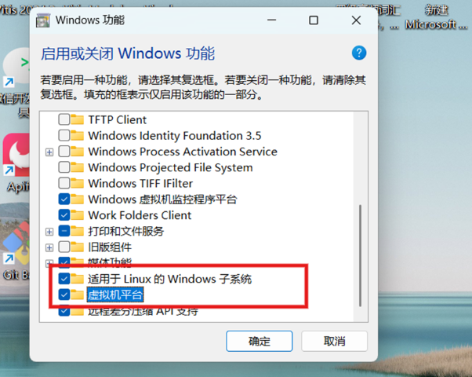

### 1、wsl安装

**1.1启用 Windows 必备功能：**

1. 打开「开始菜单」，点击「应用与程序」；
2. 滚动到页面底部，点击「程序与功能」；
3. 点击左侧「启用或关闭 Windows 功能」；
4. 在弹出的窗口中，勾选「虚拟机平台」和「适用于 Linux 的 Windows 子系统」两个选项（如图所示），点击「确定」。
5. 重启电脑。




**1.2 安装wsl2和ubuntu20.04：**

```shell
# 查看wsl、ubuntu版本：
wsl -l -v
# 升级wsl：
wsl --update --web-download
# 安装Ubuntu（非c盘安装）：
wsl --install -d Ubuntu-20.04 --location F:\wsl\Ubuntu(你自己的位置)
# 设置用户名和密码
# vscode安装wsl拓展，使用远程连接打开wsl，启动Ubuntu
```


### 2、ros安装

```shell
wget http://fishros.com/install -O fishros && . fishros
# 安装ros源 ——> 安装ros ——> 安装rosdep ——> 配置ros环境
```


### 3、双系统安装

[Windows 10 和 Ubuntu 双系统的安装和卸载教程](https://www.bilibili.com/video/BV1554y1n7zv)

